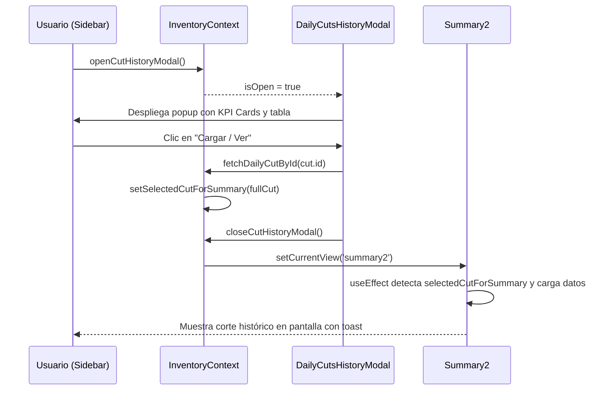

# Módulo de Resumen Diario y Cortes Congelados (`Summary2`)

Esta guía define las fórmulas matemáticas, reglas contractuales de almacenamiento en frío y la arquitectura del componente popup de **Historial de Cortes** en **Inventario Pro**.

---

## ❄️ 1. Reglas Contractuales y Tarifas de Almacenamiento en Frío

El módulo [`Summary2.jsx`](file:///c:/Proyectos%20IA/INVENTARIO/inventario/src/components/Summary/Summary2.jsx) calcula la facturación diaria de custodia en cuarto frío conforme a las tarifas contractuales registradas en [`contractRates.js`](file:///c:/Proyectos%20IA/INVENTARIO/inventario/src/utils/contractRates.js):

| Categoría | Base de Cobro | Tarifa Contractual | Fórmula Diaria |
| :--- | :--- | :--- | :--- |
| **1. Almacenamiento Congelados (-18°C)** | Libras netas al final del día | **$0.001** / libra / día | `Costo = stockFinalLibras * 0.001` |
| **2. Almacenamiento Preparados** | Cestas físicas al final del día | **$0.038** / cesta / día | `Costo = stockFinalCestas * 0.038` |
| **3. Servicios Adicionales** | Evento / Kilos / Bultos | Según catálogo | Congelación ($0.03/kg), Emplaye ($54.00), Maniobras |

---

## 🧮 2. Integridad en Cascada (`ensureCascadingIntegrity`)

Para que el informe financiero sea matemáticamente estricto y auditable por clientes:
1. **Día 1**: El saldo inicial proviene de las existencias consolidadas al cierre del día anterior (o corte histórico previo).
2. **Saldo Final**:
   $$\text{Saldo Final} = \text{Saldo Inicial} + \text{Entradas} - \text{Salidas}$$
3. **Casacada Obligatoria**: El saldo inicial del Día $N+1$ **DEBE** ser exactamente idéntico al saldo final del Día $N$:
   $$\text{Saldo Inicial}_{N+1} \equiv \text{Saldo Final}_N$$
4. Al modificar manualmente una celda en pantalla (en modo borrador), la función `ensureCascadingIntegrity` recalcula automáticamente todos los días subsiguientes en cadena para evitar discrepancias aritméticas.

---

## 🪟 3. Arquitectura del Popup `DailyCutsHistoryModal`

Para consultar cortes congelados anteriores sin perder la vista activa de trabajo:

### Componente Desacoplado:
[`src/components/Summary/DailyCutsHistoryModal.jsx`](file:///c:/Proyectos%20IA/INVENTARIO/inventario/src/components/Summary/DailyCutsHistoryModal.jsx)

### Integración en `InventoryContext`:
- `cutHistoryModalOpen` (boolean): Estado global de apertura del modal.
- `openCutHistoryModal()`: Función para abrir el modal desde cualquier componente (Sidebar, Resumen Diario, Dashboard).
- `closeCutHistoryModal()`: Cierra el modal y mantiene al usuario en su vista actual.
- `selectedCutForSummary`: Objeto con el corte cargado para que `Summary2` lo adopte inmediatamente.

### Flujo de Selección de Corte:

---

## 📄 4. Exportaciones con Fidelidad de Formato

- **PDF Oficial**: Generado con `jspdf` y `jspdf-autotable`. Mantiene cabecera institucional, tablas con bordes exactos, desglose de servicios y resumen de totales.
- **Word (.doc) Idéntico al PDF**:
  - Implementado mediante un blob HTML enriquecido con esquemas de Microsoft Word (`xmlns:o="urn:schemas-microsoft-com:office:office"`, `xmlns:w="urn:schemas-microsoft-com:office:word"`).
  - Conserva exactamente los colores, tipografías, anchos de columna y totales consolidados del PDF.

---

## 🔒 5. Estados de Corte: Bloqueado vs. Editable

- **`isLocked = true` (🔒 Bloqueado)**: El corte es oficial; sus valores son de solo lectura y no pueden ser alterados accidentalmente.
- **`isLocked = false` (🔓 Editable)**: Permite que el auditor ajuste montos o partidas antes de emitir la factura final.
- Los cambios de estado quedan registrados en la bitácora inmutable de auditoría (`system_logs`).
